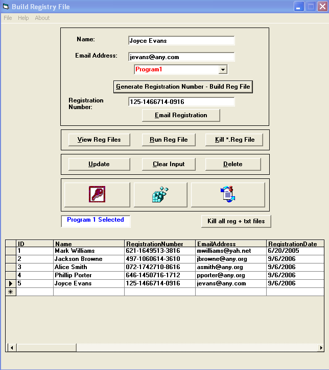



## Build Registration File and Serial Number

### Description

This program will generate a serial / registration number for programs that you

develop. It also maintains a database of users and registration numbers. In

addition, it writes and sends 'reg' files to your users via MS Outlook Express.

Currently the database, PrgmRegistration.mdb,contains two tables;

tblProgram1Reg and tblProgram2Reg. You can, and should change the names

of these tables to the names of various software that you want to have your

users register. If you have more than two programs to maintain,
 
### More Info
 

             |
---                |---
**Submitted On**   |2006-09-08 10:15:02
**By**             |[John  Cunningham](https://github.com/Planet-Source-Code/PSCIndex/blob/master/ByAuthor/john-cunningham.md)
**Level**          |Intermediate
**User Rating**    |5.0 (10 globes from 2 users)
**Compatibility**  |VB 6\.0
**Category**       |[Complete Applications](https://github.com/Planet-Source-Code/PSCIndex/blob/master/ByCategory/complete-applications__1-27.md)
**World**          |[Visual Basic](https://github.com/Planet-Source-Code/PSCIndex/blob/master/ByWorld/visual-basic.md)
**Archive File**   |[Build\_Regi201873982006\.zip](https://github.com/Planet-Source-Code/john-cunningham-build-registration-file-and-serial-number__1-66483/archive/master.zip)

